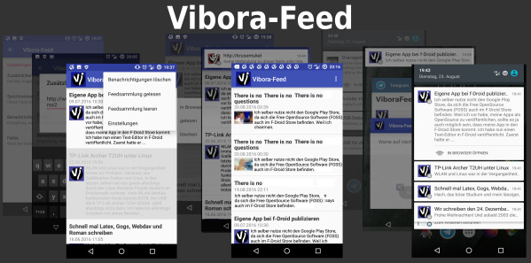
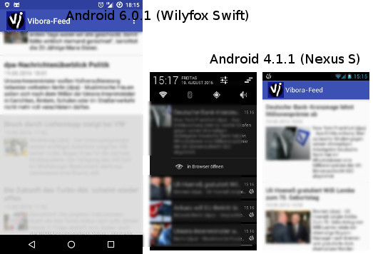
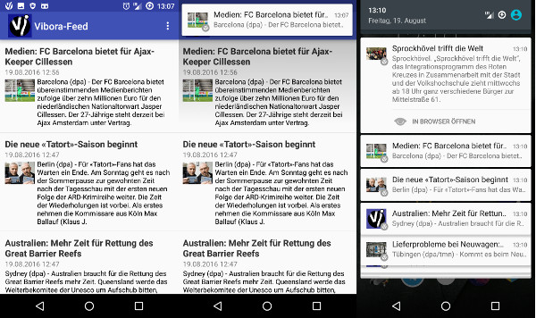
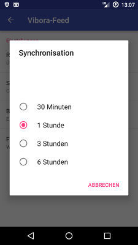
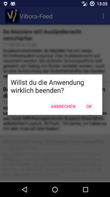
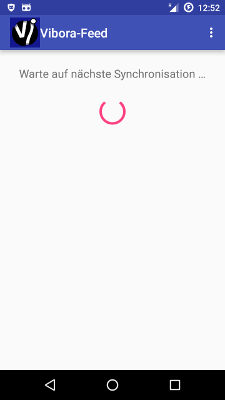
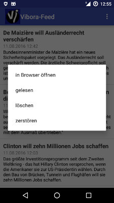
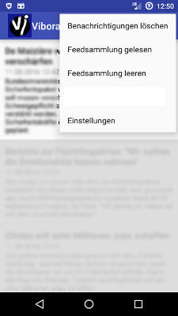
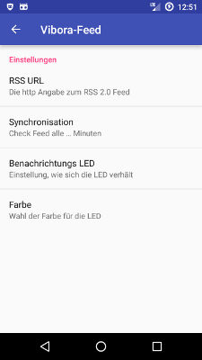
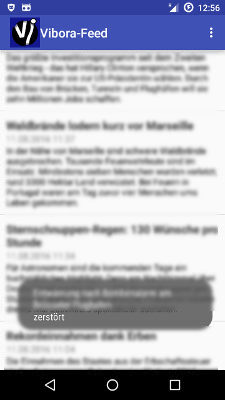

# ViboraFeed

 ViboraFeed is the Vibora Feed Reader of the http://vibora.de opensource blog homepage.
The Images in the screenshots are from testing-Feeds.

Optional get a signed APK from here: [ViboraFeed.apk](https://github.com/no-go/ViboraFeed/blob/master/app/app-release.apk?raw=true)

## Seit Version 1.2 (quasi fertig)

Javadoc ist aus meiner Sicht hinreichend gefüllt. Außerdem werden bei gelesenen Feeds die Bilder auch ausgegraut.

## Seit Version 1.1

- Logo und App-Name kleben nicht mehr beieinander
- Optional kann die App nun auch Bilder aus den Feeds extrahieren
- beginn mit JavaDoc

## Seit Version 1.0 (Mitte August 2016)

- Beim Booten wird Alarm automatisch gestartet
- Modified HTTP wird ausgewertet um Traffic zu vermeiden
- ContentProvider wird für Liste genutzt
- bisher keine Probleme mit Strict Mode
- Netzwerk Verbindung wird geprüft und nach ein paar Sekunden ein neuer Syncr. Alarm gestartet
- Feeds, die man als gelöscht markiert hat werden nach 90 Tagen aus der Datenbank entfernt
- Bei neuen Nachrichten wird ein Sound gespielt
- Man kann die Farbe und Blink-Intervall der Notifikations-LED einstellen
- Klick auf Notifikation öffnet die App
- Komplett auch in englischer Sprache

### weitere Features

Einstellen, wie oft nach neuen Feeds geschaut werden soll

Abfrage, ob man die App verlassen will

Anzeige, wenn noch keine Feeds geladen wurden

Möglichkeit, dem Link eines Feeds zur Webseite zu öffnen sowie andere Optionen

Andere Darstellung der Notifikation innerhalb der App

Jeder neue Feed bekommt eine eigene Notifikation

Options-Menü der App

Einstellungen der App (URL war nur zu Testzwecken anpassbar!)

Als gelesen markierte Feeds werden grau dargestellt

Hinweis, wenn man einen Feed gelöscht oder aus der Datenbank entfernt/zerstört hat

